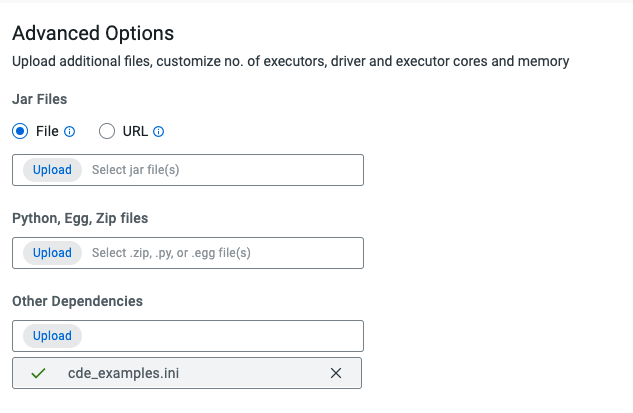

# cde_etl_demo

Three simple examples demonstrating basic features of Cloudera Data Engineering (CDE).

## Setup

Before defining and running the jobs:
1. Upload all of the ```csv/.csv``` files to cloud storage and note the path (e.g. ```s3a://your-bucket/path/to/folder```)
2. Update ```cde_examples.ini``` with the path from step 1, and a unique user prefix (__use only alphanumeric characters, starting with a letter__).  For example:
```
[CDE-examples]
s3BucketPath = "s3a://your-bucket/path/to/csv/folder"
userPrefix = user123
```

## Data Ingestion and Transformation Jobs
Create a new CDE Spark Job:
- Spark 2.4 / Python3
- name it with the suffix ```-ingest``` (for example ```user123-ingest```)
- use ```ingest.py``` as the application file
- under __Advanced Options -> Other Dependencies__ add your ```cde_examples.ini```
- __**IMPORTANT**__: instead of **Create and Run**, click the drop-down arrow and choose __**Create**__ (the jobs will be run together using Airflow)

For example:
<br/>

<br/>

<br/>


Create a second CDE Spark Job:
- Spark 2.4 / Python3
- name it with the suffix ```-enrich``` (for example ```user123-enrich```)
- use ```enrich.py``` as the application file
- under __Advanced Options -> Other Dependencies__ add your ```cde_examples.ini```
- __**IMPORTANT**__: instead of **Create and Run**, click the drop-down arrow and choose __**Create**__ (the jobs will be run together using Airflow)

## Airflow Job
Update line 7 of ```dag.py``` with the same prefix used in ```cde_examples.ini```.  For example:
```
PREFIX = 'user123'
```

Create a CDE Airflow Job:
- name it with suffix ```-airflow``` (for example ```user123-airflow```)
- use application file ```dag.py```
- __**IMPORTANT**__: instead of **Create and Run**, click the drop-down arrow and choose __**Create**__

## PySpark with Dependencies (Define a Python Environment Resource)
Create a new Python Environment CDE Resource:
- name it with suffix ```-penv-resource``` (for example ```user123-penv-resource```)
- Type: Python Environment
- Python 3
- when prompted to 'Upload File', upload the ```udf_examples/requirements.txt``` file included in this repository


## PySpark with Dependencies (Define the Job)
Create a CDE Spark Job:
- Spark 2.4 / Python3
- name it with the suffix ```-udf``` (for example ```user123-udf```)
- use ```udf_examples/deps_udf_dependency.py``` as the application file
- under **__Configurations__**, specify a **__key__** ```spark.executorEnv.PYTHONPATH``` and **__value__** ```/app/mount/demo_utils.zip```
- under **__Python Environment__**, choose the Python Environment resource you created in the previous step (e.g. ```user123-penv-resource```)
- under __Advanced Options -> Python, Egg, Zip files__ add your ```demo_utils.zip```
- under __Advanced Options -> Other Dependencies__ add your ```cde_examples.ini```
- Click __**Create and Run**__


